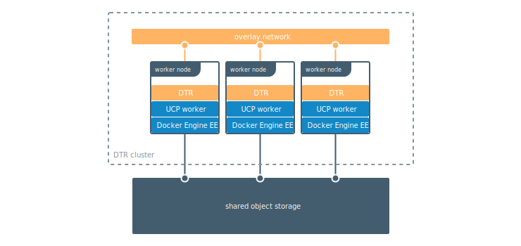
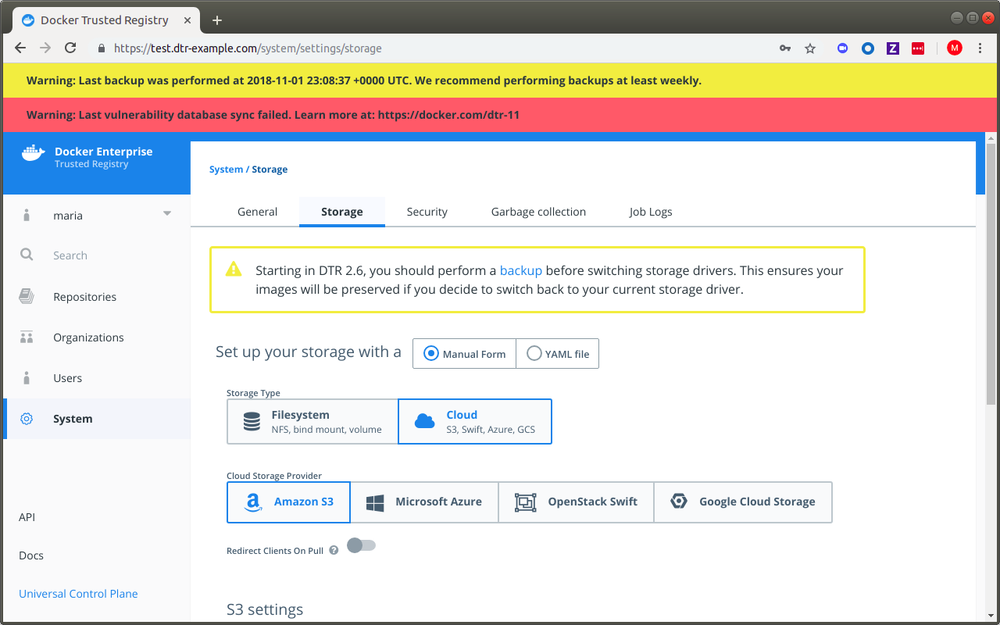

## Configure your storage backend

By default DTR uses the local filesystem of the node where it is running to
store your Docker images. You can configure DTR to use an external storage
backend, for improved performance or high availability.



If your DTR deployment has a single replica, you can continue using the
local filesystem for storing your Docker images. If your DTR deployment has
multiple replicas, make sure all replicas are
using the same storage backend for high availability. Whenever a user pulls an image, the DTR
node serving the request needs to have access to that image.

DTR supports the following storage systems:

* Local filesystem
   * [NFS](nfs.md)
   * [Bind Mount](/storage/bind-mounts/)
   * [Volume](/storage/volumes/)
* Cloud Storage Providers
   * [Amazon S3](s3.md)
   * [Microsoft Azure](/registry/storage-drivers/azure/)
   * [OpenStack Swift](/registry/storage-drivers/swift/)
   * [Google Cloud Storage](/registry/storage-drivers/gcs/)

> **Note**: Some of the previous links are meant to be informative and are not representative of DTR's implementation of these storage systems. 

To configure the storage backend, log in to the DTR web interface
as an admin, and navigate to **System > Storage**.

{: .with-border}

The storage configuration page gives you the most
common configuration options, but you have the option to upload a configuration file in `.yml`, `.yaml`, or `.txt` format.

See [Docker Registry Configuration](/registry/configuration.md) for configuration options.

## Local filesystem

By default, DTR creates a volume named `dtr-registry-<replica-id>` to store
your images using the local filesystem. You can customize the name and path of
the volume by using `docker/dtr install --dtr-storage-volume` or `docker/dtr reconfigure --dtr-storage-volume`. 

>  When running DTR 2.5 (with experimental online garbage collection) and 2.6.0 to 2.6.3, there is an issue with [reconfiguring DTR with `--nfs-storage-url`](/ee/dtr/release-notes#version-26) which leads to erased tags. Make sure to [back up your DTR metadata](/ee/dtr/admin/disaster-recovery/create-a-backup/#back-up-dtr-metadata) before you proceed. To work around the `--nfs-storage-url` flag issue, manually create a storage volume on each DTR node. If DTR is already installed in your cluster, [reconfigure DTR](https://success.docker.com/article/dtr-26-lost-tags-after-reconfiguring-storage#reconfigureusingalocalnfsvolume) with the `--dtr-storage-volume` flag using your newly-created volume.  
{: .warning}

If you're deploying DTR with high-availability, you need to use NFS or any other
centralized storage backend so that all your DTR replicas have access to the
same images.

To check how much space your images are utilizing in the local filesystem, SSH into the DTR node and run:

```bash

# Find the path to the volume
docker volume inspect dtr-registry-<replica-id>

# Check the disk usage
sudo du -hs \
$(dirname $(docker volume inspect --format '{{.Mountpoint}}' dtr-registry-<dtr-replica>))

```

### NFS

You can configure your DTR replicas to store images on an NFS partition, so that
all replicas can share the same storage backend.

[Learn how to configure DTR with NFS](nfs.md).

## Cloud Storage

### Amazon S3

DTR supports Amazon S3 or other storage systems that are S3-compatible like Minio.
[Learn how to configure DTR with Amazon S3](s3.md). 

## Switching storage backends

Starting in DTR 2.6, switching storage backends initializes a new metadata store and erases your existing tags. This helps facilitate online garbage collection, which has been introduced in 2.5 as an experimental feature. Make sure to [perform a backup](/ee/dtr/admin/disaster-recovery/create-a-backup/#back-up-dtr-data) before you change your storage backend when running DTR 2.5 (with online garbage collection) and 2.6.0-2.6.3. If you encounter an issue with lost tags, refer to the following resources:
  * For changes to reconfigure and restore options in DTR 2.6, see [docker/dtr reconfigure](/reference/dtr/2.6/cli/reconfigure/) and [docker/dtr restore](/reference/dtr/2.6/cli/restore). 
  * For Docker's recommended recovery strategies, see [DTR 2.6 lost tags after reconfiguring storage](https://success.docker.com/article/dtr-26-lost-tags-after-reconfiguring-storage).
  * For NFS-specific changes, see [Use NFS](nfs.md). 
  * For S3-specific changes, see [Learn how to configure DTR with Amazon S3](s3.md).

## Where to go next

- [Use NFS](nfs.md)
- [Use S3](s3.md)
- CLI reference pages
  - [docker/dtr install](/reference/dtr/2.6/cli/install/)
  - [docker/dtr reconfigure](/reference/dtr/2.6/cli/reconfigure/)
  - [docker/dtr restore](/reference/dtr/2.6/cli/restore/)
